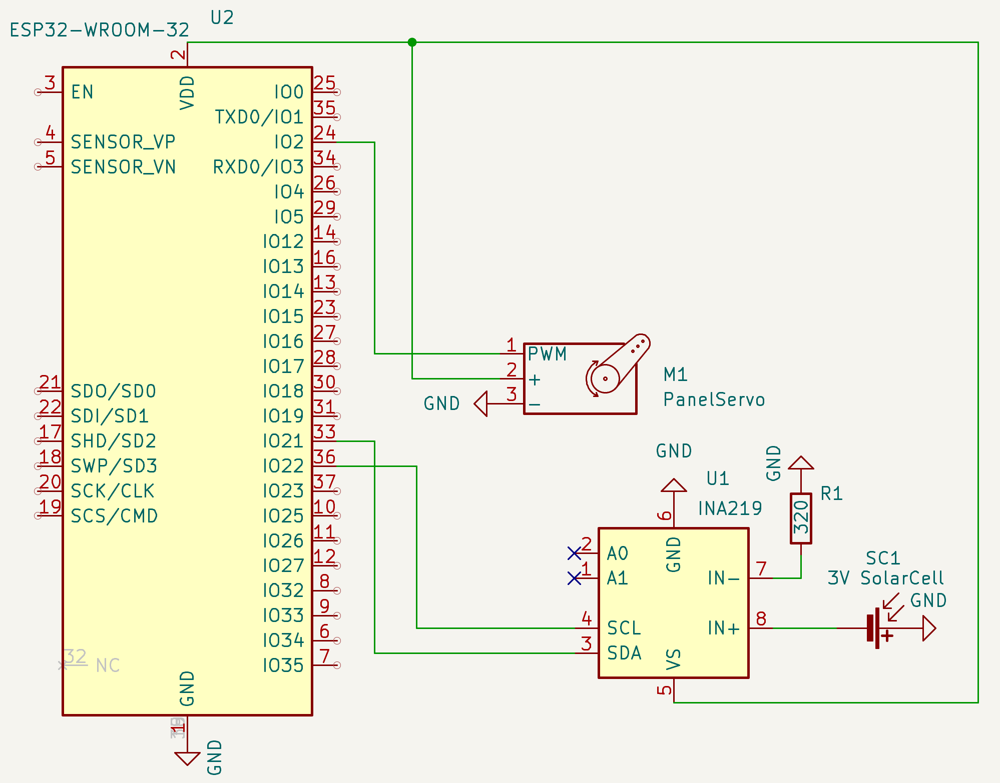

# SunTracker - Renewable IoT ☀️

Finding the ideal position of a panel to generate as much power as possible is a challenge in solar energy production. 
This cool IoT project creates a device that finds the highest voltage a panel can make throughout the day.
This can be useful for analyzing if a panel is economically feasible in a certain location.
The data collected in a database can be used for further analysis.

## Hardware

- ESP32-Wroom microcontoller
- INA129
- 60mmx60mm 3V 0.3W Solar panel
- 1-axis servo motor
- 320 Ω resistor

## Schematic

The panel is mechanically mounted on the servo. Between the Ina219 VIn- and GND a resistor is connected to ensure the Ina219 is within range to also measure current for later use.
A timer interrupt calls a routine every 5 minutes, tilting the panel from 0 to 180 degrees and staying at the angle with the highest bus voltage. 

The schematic below in KiCad also shows the wiring to the pins.

## Software

The whole software is built in C++, using the esp-idf development tool and CMake for managing external and internal libraries.

The collected data (voltage and angle) is uploaded to a MQTT server using the Wifi. The MQTT data is picked up by a Rasbarry Pi home server and uploaded to a InfluxDB Database. This has advantages over a SQL database since we have a time series. The data is then visualized using Grafana. The whole stack is managed over Node Red, all deployed inside a single docker container.

## Further developments

The product will be expanded to measure moisture and temperature of air and ground and will be used in a prototype for a [Agripholtaics](https://www.ise.fraunhofer.de/en/business-areas/solar-power-plants-and-integrated-photovoltaics/integrated-photovoltaics/agrivoltaics.html#:~:text=Agrivoltaics%20describes%20a%20process%20for,production%20and%20PV%20power%20generation.) potential analysis tool. The software for analysis using the newest research is currently being developed.
